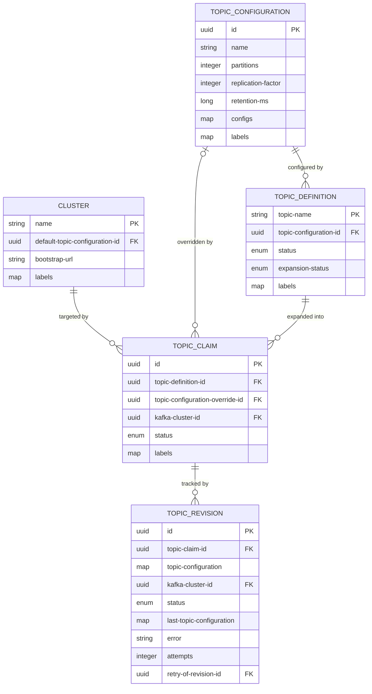
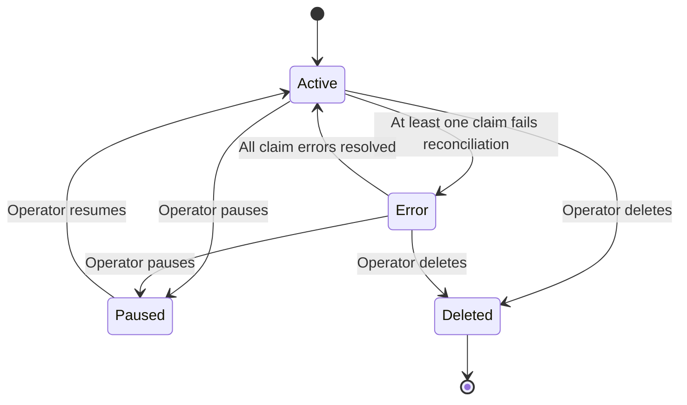
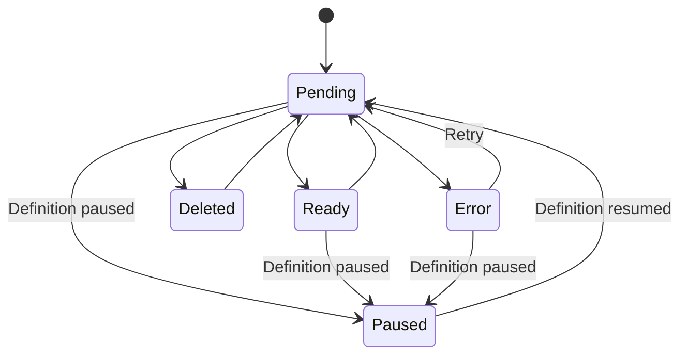
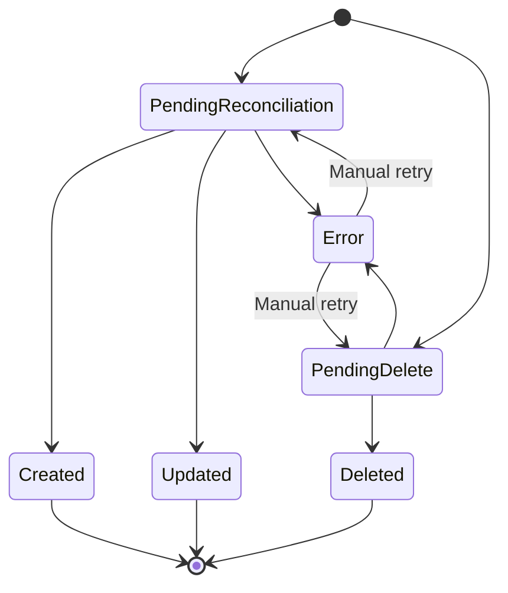
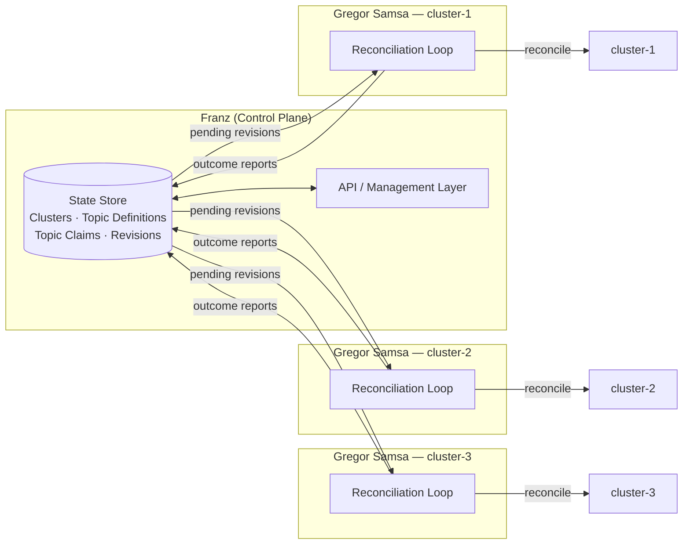

# Architecture Overview

Describes how the management of a large Kafka fleet with resources across many clusters and locations.

## Important Concepts

- The architecture is declarative, which means it is unidirectional. Specs defined in Franz are applied to the clusters, but there is no automatic update from the Kafka cluster back to Franz.

## Components

### Franz (Control Plane)

Franz is aware of all registered Kafka clusters and their resources (topics, ACLs, etc.) across the fleet. It maintains desired state and exposes a management API. It also enforces governance rules and drives topic claim expansion.

### Gregor Samsa (Reconciler)

One Gregor Samsa instance runs per Kafka cluster. It polls Franz for pending revisions, reconciles the desired state against the actual Kafka cluster, and reports back what it did.

---

## Domain Model

### Cluster

| Field | Type | Required | Description |
|---|---|---|---|
| `name` | `string` | Yes | Unique identifier. Immutable after creation. Used as the natural key in API paths. |
| `default-topic-configuration-id` | `uuid` | Yes | Default TopicConfiguration applied to topics on this cluster. |
| `bootstrap-url` | `string` | Yes | Kafka bootstrap server URL. |
| `labels` | `map<string, string>` | No | Arbitrary key-value metadata. Defaults to empty map. |

### TopicConfiguration

Standalone entity holding Kafka topic config parameters. Referenced by TopicDefinition and optionally overridden per TopicClaim.

| Field | Type | Required | Description |
|---|---|---|---|
| `name` | `string` | Yes | Unique name. |
| `partitions` | `integer` | Yes | Number of partitions. Can only increase, never decrease. |
| `replication-factor` | `integer` | Yes | Number of replicas per partition. |
| `retention-ms` | `long` | Yes | Message retention time in milliseconds. |
| `configs` | `map<string, string>` | No | Additional Kafka topic config entries. Defaults to empty map. |
| `labels` | `map<string, string>` | No | Arbitrary key-value metadata. Defaults to empty map. |

### TopicDefinition

A template for topics that will exist inside Kafka clusters. Does not hold config fields directly — references a TopicConfiguration.

| Field | Type | Required | Description |
|---|---|---|---|
| `topic-name` | `string` | Yes | Unique topic name. Immutable after creation. Same as the real topic name in Kafka. |
| `topic-configuration-id` | `uuid` | Yes | FK to TopicConfiguration. Applied to all claims, overrides cluster default. |
| `status` | `enum` | Yes | `Active` \| `Paused` \| `Error` \| `Deleted` |
| `expansion-status` | `enum` | Yes | `Expanded` \| `PendingExpansion` — whether all eligible clusters have claims. |
| `labels` | `map<string, string>` | No | Arbitrary key-value metadata. Defaults to empty map. |

### TopicClaim

Represents one topic on one cluster. Created automatically by Franz during expansion.

| Field | Type | Required | Description |
|---|---|---|---|
| `id` | `uuid` | Yes | System-generated unique identifier. |
| `topic-definition-id` | `uuid` | Yes | FK to TopicDefinition. |
| `topic-configuration-override-id` | `uuid` | No | FK to TopicConfiguration. Overrides definition config for this claim only. |
| `kafka-cluster-id` | `uuid` | Yes | FK to Cluster. |
| `status` | `enum` | Yes | `Pending` \| `Ready` \| `Paused` \| `Deleted` \| `Error` |
| `labels` | `map<string, string>` | No | Arbitrary key-value metadata. Defaults to empty map. |

### TopicRevision

Tracks a single reconciliation attempt for a claim. Franz creates one revision per change event.

| Field | Type | Required | Description |
|---|---|---|---|
| `id` | `uuid` | Yes | System-generated unique identifier. |
| `topic-claim-id` | `uuid` | Yes | FK to TopicClaim. |
| `topic-configuration` | `map<string, any>` | Yes | Materialized config values at the time of this revision. |
| `kafka-cluster-id` | `uuid` | Yes | Target cluster. |
| `status` | `enum` | Yes | `PendingReconciliation` \| `PendingDelete` \| `Created` \| `Updated` \| `Deleted` \| `Error` |
| `last-topic-configuration` | `map<string, any>` | No | Config actually applied by Gregor Samsa. Always present on success. |
| `error` | `string` | No | Error description from the last failed reconciliation attempt. |
| `attempts` | `integer` | No | Number of reconciliation attempts made. |
| `retry-of-revision-id` | `uuid` | No | FK to the revision this one retries. Enables full retry chain queries. |

### Configuration override hierarchy

Cluster default config → TopicDefinition config → TopicClaim override (most specific wins)

---

## Entity Relationships

---

## State Machines

### TopicDefinition

### TopicClaim

### TopicRevision

---

## Overview

