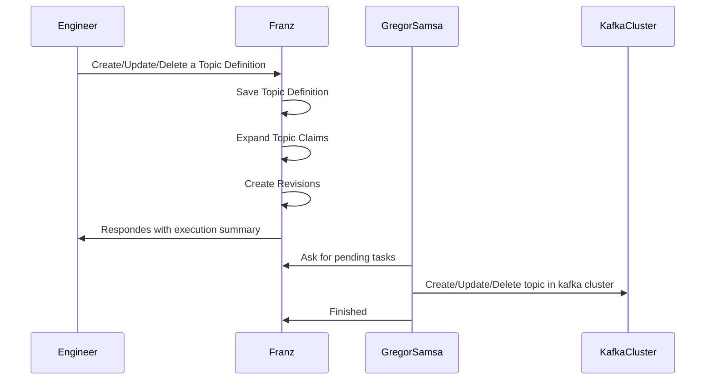
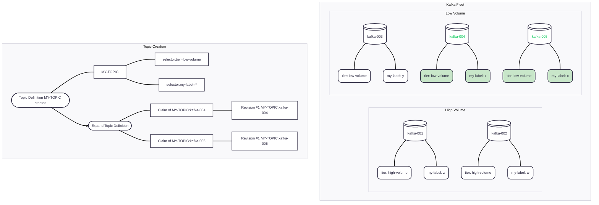

# Kafka Cluster Management

The topic definition works like a template to topics that will actually exist inside the kafka cluster. It has a set of configuration that will be used to configure the topic in kafka.

The key take way of this is that a topic definition is an entity that can be linked to many topic claim 1:N, while for each claim should exist one real topic inside kafka.

## Concepts

| Concept | Description |
|---|---|
| **Topic CLaim** | Is a object used to track the reconciliation with the actual topic. |
| **Topic Configuration** | The configuration of the topic that will be used when no other more specific configuration is given. |
| **Topic Configuration Override** | As the configuration is set to object that are more specific, it overrides the more generalist one. |
| **Labels** | Can be used as a metadata store to add any information to the cluster and in logs to find, associate and match the cluster with other resources. |

## Data Model

### Topic Configuration

| Field | Type | Required | Description |
|---|---|---|---|
| `name` | `string` | Yes |  |
| `partitions` | `integer` | Yes | Number of partitions. Can only increase, never decrease. |
| `replication-factor` | `integer` | Yes | Number of replicas per partition. |
| `retention-ms` | `long` | Yes | Message retention time in milliseconds. When omitted, the broker default applies. |
| `configs` | `map<string, string>` | No | Additional Kafka topic configuration entries (e.g. `cleanup.policy`, `compression.type`). Defaults to an empty map. |
| `labels` | `map<string, string>` | No | Arbitrary key-value metadata for categorization and filtering. Defaults to an empty map. |

### Topic Definition

| Field | Type | Required | Description |
|---|---|---|---|
| `topic-name` | `string` | Yes | Unique topic definition name among the definition. Same as the real topic name in kafka clusters. |
| `topic-configuration-id` | `uuid` | Yes | The configuration of the topic. Will be applied to all topics and override the default cluster definition. |
| `labels` | `map<string, string>` | No | Arbitrary key-value metadata for categorization and filtering. Defaults to an empty map. |

# HTTP Endpoints
All endpoints are served under `/api/v0/`.

### Topic Configuration
| Method | Endpoint | Description |
|---|---|---|
| `GET` | `/api/v0/topic_configurations` | List all topic configuration, with pagination. |
| `POST` | `/api/v0/topic_configurations` | Create a new topic configuration. |
| `GET` | `/api/v0/topic_configurations/:topic-configuration-id` | Return the details of a specific topic configuration. |
| `PUT` | `/api/v0/topic_configurations/:topic-configuration-id` | Update a specific topic configuration. |
| `DELETE` | `/api/v0/topic_configurations/:topic-configuration-id` | Delete a specific topic configuration data. |

### Topic Definition
| Method | Endpoint | Description |
|---|---|---|
| `GET` | `/api/v0/topic_definitions` | List all topic definition, with pagination. |
| `POST` | `/api/v0/topic_definitions` | Create a new topic definition. |
| `GET` | `/api/v0/topic_definitions/:topic-definition-name` | Return the details of a specific topic definition. |
| `PUT` | `/api/v0/topic_definitions/:topic-definition-name` | Update a specific topic definition. |
| `DELETE` | `/api/v0/topic_definitions/:topic-definition-name` | Delete a specific topic definition data. |

## Pagination

List endpoints accept `page` and `size` query parameters.

| Parameter | Type | Default | Description |
|---|---|---|---|
| `page` | `integer` | `1` | Page number (1-indexed). |
| `size` | `integer` | `20` | Number of items per page. |

Example: `GET /api/v0/topic-definitions?page=2&size=10`

### Triggers of the flow

#### Topic is created

### Topic cluster selection

