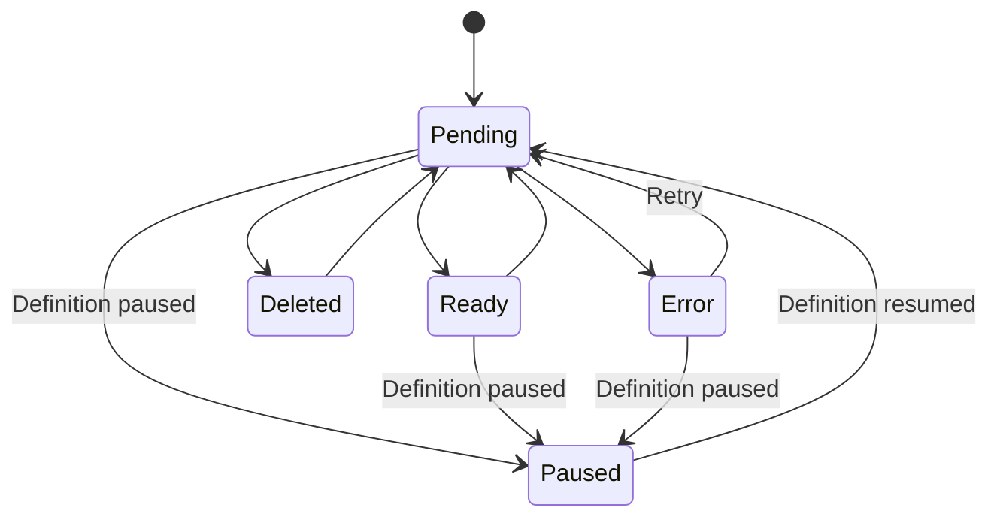
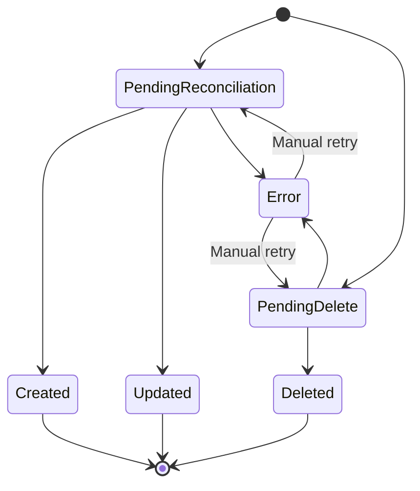

# Topic Claim

The topic claim is the declaration of the state of a topic to a single cluster, in other words is the expectation of a topic.

### Topic Claim Schema

| Field | Type | Required | Description |
|---|---|---|---|
| `id` | `uuid` | Yes | Unique id for claim |
| `topic-definition-id` | `uuid` | Yes | the topic definition |
| `topic-configuration-override-id` | `uuid` | No | The configuration that will override the configs from cluster or topic definition. |
| `kafka-cluster-id` | `uuid` | Yes | The id of the cluster it will be in. |
| `status` | `string` | Yes | The status inside the values defined in the state machine. |
| `labels` | `map<string, string>` | No | Arbitrary key-value metadata for categorization and filtering. Defaults to an empty map. |

### Topic Revision Schema

| Field | Type | Required | Description |
|---|---|---|---|
| `id` | `uuid` | Yes | Unique id for revision |
| `topic-claim-id` | `uuid` | Yes | The topic claim id. |
| `topic-configuration` | `map<string, any>` | Yes | Computed configuration. |
| `kafka-cluster-id` | `uuid` | Yes | The id of the cluster it will be rollout to. It is necessary here since a cluster could be migrated in a revision and if success, update the claim. |
| `status` | `string` | Yes | The status of this revision. |
| `last-topic-configuration` | `map<string, any>` | No | The configuration actually applied by Gregor Samsa. Always present on success. May be present on failure if a partial configuration was applied before the error. |
| `error` | `string` | No | The error description from the last failed reconciliation attempt. |
| `attempts` | `integer` | No  | The attempts made to apply the change. |
| `retry-of-revision-id` | `uuid` | No | Points to the failed revision this one retries. Enables the full retry chain to be queried. |

### Topic Claim state machine transitions:



### Topic Revision state machine transitions:


### Franz Claim Endpoints
| Verb | Path | Description |
|---|---|---|
| `PUT` | `/api/v0/clusters/:cluster-name/claims/:claim-id/update-config` | Update config, adding or updating the config. |
| `PUT` | `/api/v0/clusters/:cluster-name/claims/:claim-id/cluster-migration` | Migrate a cluster from a cluster to another one. |

### Franz Agent Endpoints
| Verb | Path | Description |
|---|---|---|
| `GET` | `/api/v0/clusters/:cluster-name/poll-pending-reconciliations` | Return the pending revisions and its claims to be conciliated. |
| `PUT` | `/api/v0/clusters/:cluster-name/inform-reconciliation-status/:revision-id` | Inform the execution state. |
| `POST` | `/api/v0/clusters/:cluster-name/claims/:claim-id/retry` | Retry a single errored claim. |
| `POST` | `/api/v0/topics/:topic-name/retry` | Retry all errored claims for a topic across all clusters. |

#### Retry

Retry creates a new revision with the same intent as the failed one. The failed revision is preserved as a historical record. The new revision carries a `retry-of-revision-id` pointing back to the failed revision, enabling the full retry chain to be queried.

Both retry endpoints require the claim to be in `Error` state and its latest revision to also be in `Error` state. If the latest revision is not in `Error` (e.g. Gregor Samsa already picked it up), the request is rejected with `409`.

The claims list will return the claims filtered in a given state. It will contain also the computed configuration for the topic.

`GET` `/api/v0/clusters/:cluster-name/poll-pending-reconciliations`
```json
{
    "revisions": [
        {
            "claim": {
                "id": "uuid-v4",
                "topic-definition": {
                    "topic-id": "uuid-v4",
                    "name": "TOPIC-NAME",
                    "labels": {
                        "my-namespace/any": "info"
                    }
                },
                "kafka-cluster": {
                    "name": "cluster-name",
                    "bootstrap-url": "localhost:9092"
                },
                "labels": {
                    "my-namespace/any": "other info"
                },
                "status": "Pending"
            },
            "revision": {
                "topic-configuration": {
                    "retention-ms": 99999,
                    "partitions": 4,
                    "replication-factor": 3,
                    "cleanup.policy": "delete"
                },
                "kafka-cluster": {
                    "name": "cluster-name",
                    "bootstrap-url": "localhost:9092"
                },
                "status": "PendingReconciliation"
            }
        }, //..
    ]
}
```

`POST` `/api/v0/clusters/:cluster-name/claims/:claim-id/retry`

Response `201`:
```json
{
    "claim-id": "uuid",
    "cluster-name": "production-us-east-1",
    "claim-status": "Pending",
    "revision": {
        "id": "uuid",
        "status": "PendingReconciliation",
        "retry-of-revision-id": "uuid-of-failed-revision"
    }
}
```

`POST` `/api/v0/topics/:topic-name/retry`

Response `200` (each claim is retried independently — partial success is possible):
```json
{
    "topic-name": "user-events",
    "retried": [
        {
            "claim-id": "uuid-1",
            "cluster-name": "production-us-east-1",
            "claim-status": "Pending",
            "revision": {
                "id": "uuid",
                "status": "PendingReconciliation",
                "retry-of-revision-id": "uuid-of-failed-revision"
            }
        }
    ],
    "failed": [
        {
            "claim-id": "uuid-2",
            "cluster-name": "staging",
            "error": "revision-not-in-error",
            "message": "Latest revision is in 'PendingReconciliation' state, cannot retry"
        }
    ]
}
```

### Status reference

| TopicDefinition | TopicClaim | Last Revision | Meaning |
|---|---|---|---|
| `Active` | `Pending` | `PendingReconciliation` | Claim exists, topic creation or update in flight |
| `Active` | `Ready` | `Created` | Topic live, last operation was creation |
| `Active` | `Ready` | `Updated` | Topic live, last operation was a config update |
| `Active` | *(no claims)* | *(none)* | Definition exists but no cluster matches its selectors |
| `Error` | `Error` | `Error` | At least one claim failed reconciliation — definition reflects the degraded state |
| `Paused` | `Paused` | `Created` / `Updated` | Topic live on Kafka, definition and claims suspended |
| `Paused` | `Paused` | `PendingReconciliation` / `PendingDelete` | Was in flight when paused — Gregor Samsa will not pick up work |
| `Paused` | `Paused` | `Error` | Failed before pausing, frozen in error state |
| `Deleted` | `Pending` | `PendingDelete` | Deletion requested, topic removal in flight on Kafka |
| `Deleted` | `Deleted` | `Deleted` | Topic successfully removed from Kafka |
| `Deleted` | `Error` | `Error` | Deletion failed — topic likely still exists on Kafka (?) |

### Reconciliation outcome mapping


When Franz receives an inform call, it maps the outcome reported by Gregor Samsa to both the revision terminal state and the new claim state:

| Gregor Samsa outcome | Revision terminal state | Claim state |
|---|---|---|
| `created` | `Created` | `Ready` |
| `updated` | `Updated` | `Ready` |
| `deleted` | `Deleted` | `Deleted` |
| `error` | `Error` | `Error` |

`PUT` `/api/v0/clusters/:cluster-name/inform-reconciliation-status/:revision-id`

Topic was created:
```json
{
    "outcome": "created",
    "last-topic-configuration": {
        "retention-ms": 555555,
        "partitions": 2,
        "replication-factor": 3,
        "cleanup.policy": "delete"
    }
}
```

Topic was updated:
```json
{
    "outcome": "updated",
    "last-topic-configuration": {
        "retention-ms": 555555,
        "partitions": 2,
        "replication-factor": 3,
        "cleanup.policy": "delete"
    }
}
```

Topic was deleted:
```json
{
    "outcome": "deleted"
}
```

Failure:
```json
{
    "outcome": "error",
    "error": "failed to connect to broker at localhost:9092: connection refused"
}
```

Failure with partial configuration (Gregor Samsa was able to read the current state before failing):
```json
{
    "outcome": "error",
    "error": "is not possible to reduce partitions in a topic",
    "last-topic-configuration": {
        "retention-ms": 555555,
        "partitions": 2,
        "replication-factor": 2,
        "cleanup.policy": "delete"
    }
}
```

## Pagination

List endpoints accept `page` and `size` query parameters.

| Parameter | Type | Default | Description |
|---|---|---|---|
| `page` | `integer` | `1` | Page number (1-indexed). |
| `size` | `integer` | `20` | Number of items per page. |

Example: `GET /api/v0/clusters/:cluster-name/claims?status=<status>&page=2&size=10`
