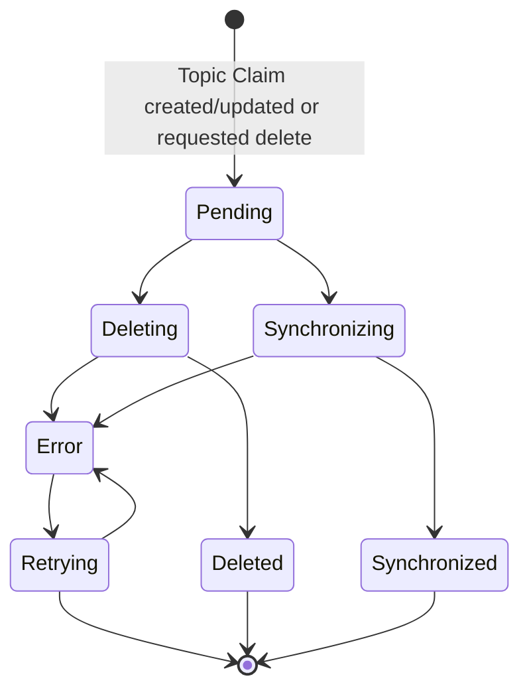

# Topic Claim

The topic claim is the declation of the state of a topic to a single cluster defined by the topic definition.

### Topic Claim

| `GET` | `/api/v0/clusters/:cluster-name/claims?status=<status>` | Return the claims with all (not specified) or specific state. |
| `PUT` | `/api/v0/clusters/:cluster-name/:claim-id` | Set claim state. There is some allowed transition. |

