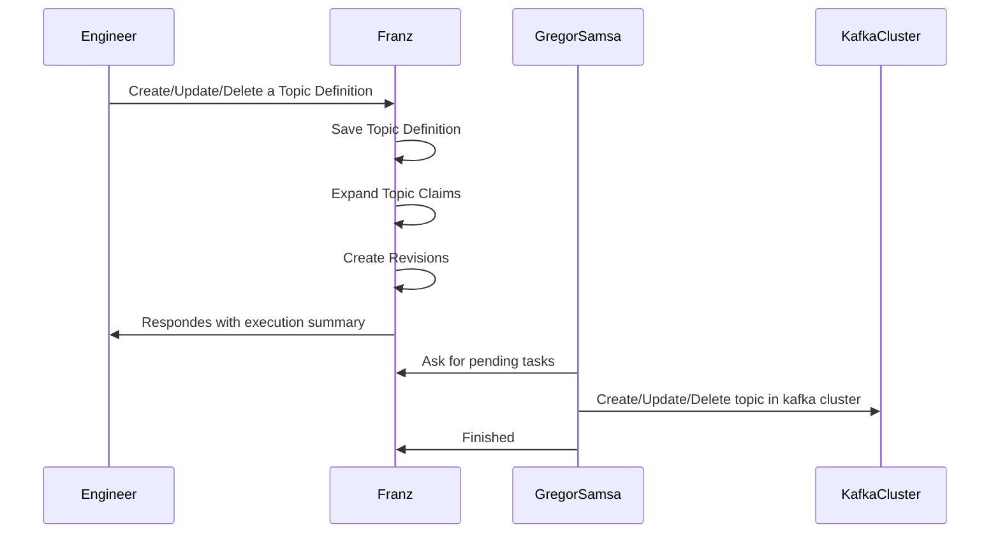
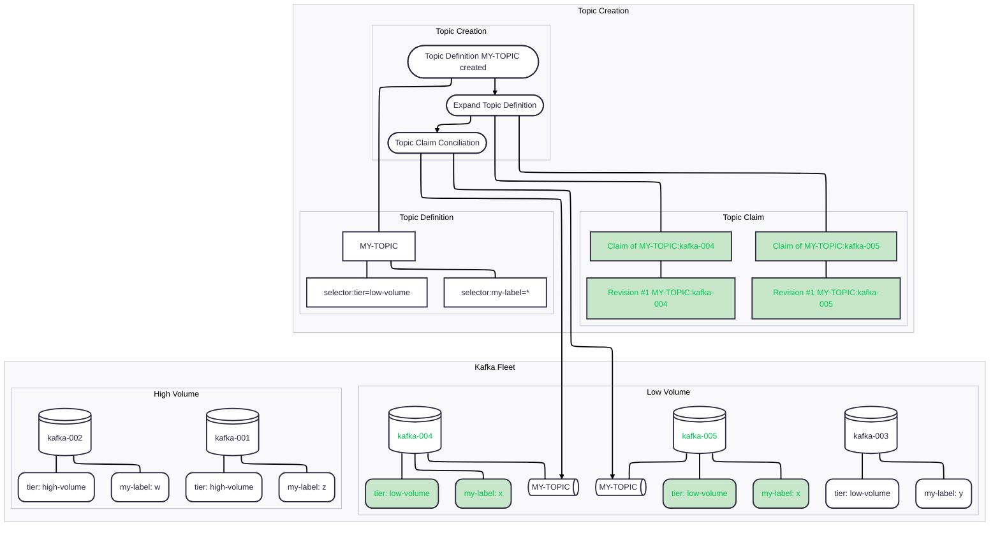
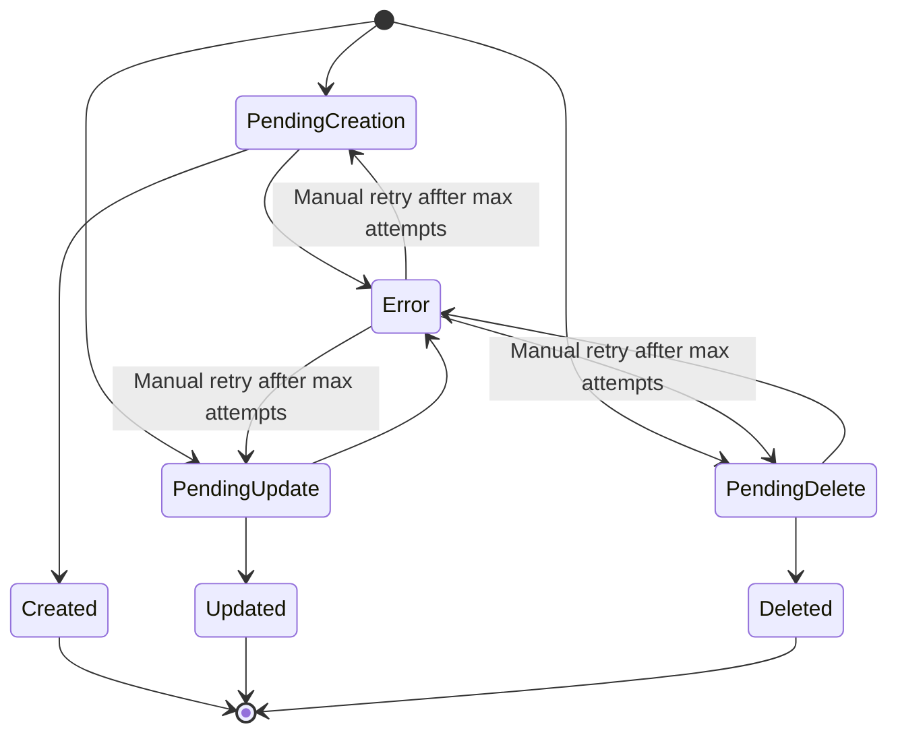
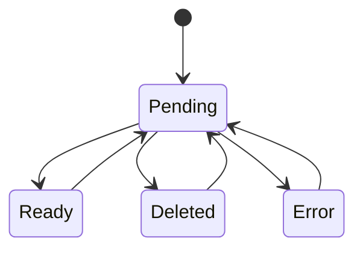

# Topic Claim

The topic claim is the declaration of the state of a topic to a single cluster, in other words is the expectation of a topic.

### Topic Claim Schema

| Field | Type | Required | Description |
|---|---|---|---|
| `id` | `uuid` | Yes | Unique id for claim |
| `topic-definition-id` | `uuid` | Yes | the topic definition |
| `topic-configuration-override-id` | `uuid` | No | The configuration that will override the configs from cluster or topic definition. |
| `kafka-cluster-id` | `uuid` | Yes | The id of the cluster it will be in. |
| `status` | `string` | The status inside the volues defined in the state machine. |
| `labels` | `map<string, string>` | No | Arbitrary key-value metadata for categorization and filtering. Defaults to an empty map. |

### Topic Revision Schema

| Field | Type | Required | Description |
|---|---|---|---|
| `id` | `uuid` | Yes | Unique id for rollout |
| `topic-claim-id` | `uuid` | Yes | The topic claim id. |
| `topic-configuration` | `map<string, string>` | Yes | Computed configuration. |
| `kafka-cluster-id` | `uuid` | Yes | The id of the cluster it will be rollout to. |
| `status` | `string` | The status of this revision. |
| `attempts` | `integer` | The attempts made to apply the change. |
| `applied_by` | `integer` | The moment the revision was applied. |

### Triggers of the flow

#### Topic is created




### Topic Revision state machine transitions:


### Topic Claim state machine transitions:



### Topic Claim Endpoints
| Verb | Path | Description |
|---|---|---|
| `GET` | `/api/v0/clusters/:cluster-name/poll-pending-revisions` | Return the claims with all (not specified) or specific state. |
| `PUT` | `/api/v0/clusters/:cluster-name/claims/:claim-id/change-state` | Set claim state. There is some allowed transition. |


The claims list will return the claims filtered in a given state. It will contain also the computed configuration for the topic.

`GET` `/api/v0/clusters/:cluster-name/claims?status=<status>`
```json
[
    "claims": {
        "topic-definition": {
            "topic-id": "",
        },
        "topic-configuration": {

        },
        "kafka-cluster": {

        },
        "labels": {
            
        },
        "status": "",
    }, //..
]
```

## Pagination

List endpoints accept `page` and `size` query parameters.

| Parameter | Type | Default | Description |
|---|---|---|---|
| `page` | `integer` | `1` | Page number (1-indexed). |
| `size` | `integer` | `20` | Number of items per page. |

Example: `GET /api/v0/clusters/:cluster-name/claims?status=<status>&page=2&size=10`
