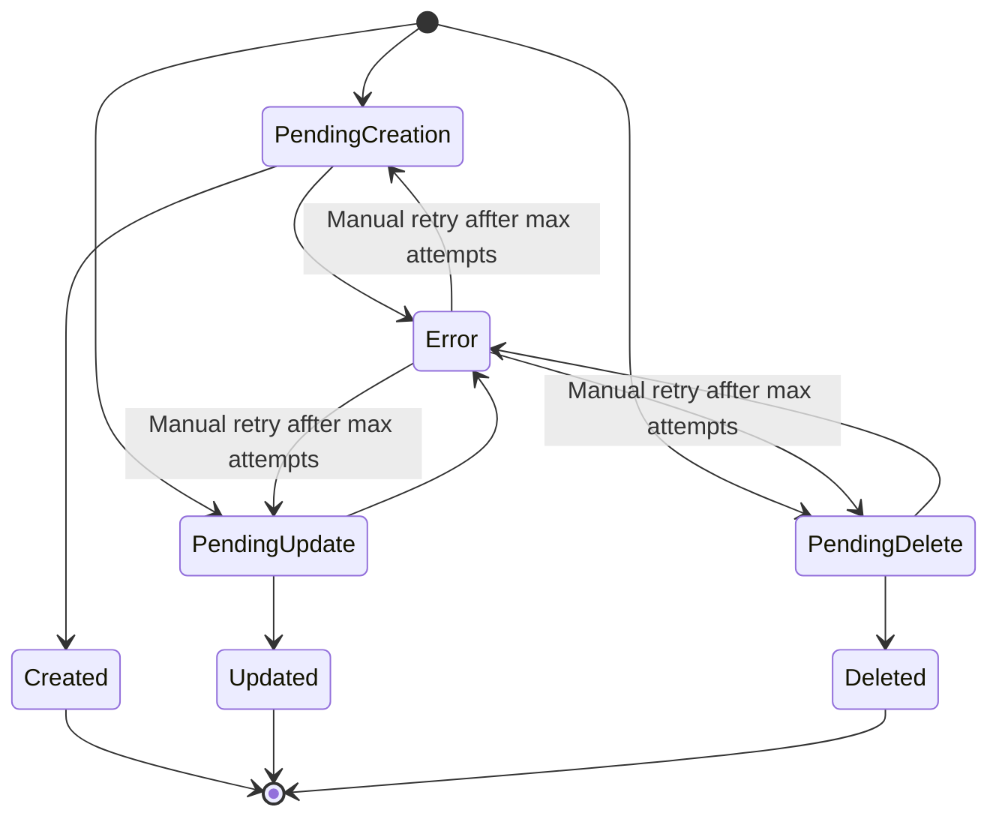
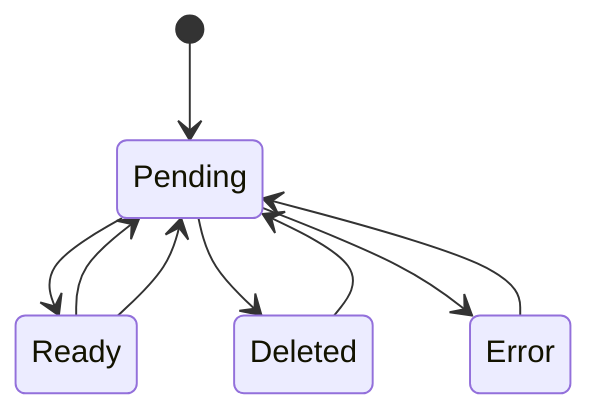
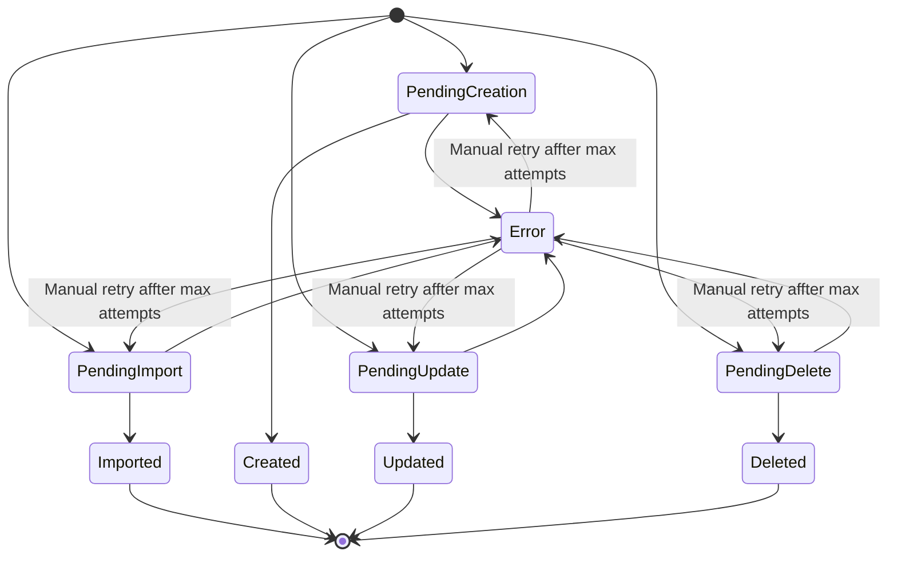

# Topic Claim

The topic claim is the declaration of the state of a topic to a single cluster, in other words is the expectation of a topic.

### Topic Claim Schema

| Field | Type | Required | Description |
|---|---|---|---|
| `id` | `uuid` | Yes | Unique id for claim |
| `topic-definition-id` | `uuid` | Yes | the topic definition |
| `topic-configuration-override-id` | `uuid` | No | The configuration that will override the configs from cluster or topic definition. |
| `kafka-cluster-id` | `uuid` | Yes | The id of the cluster it will be in. |
| `status` | `string` | The status inside the volues defined in the state machine. |
| `labels` | `map<string, string>` | No | Arbitrary key-value metadata for categorization and filtering. Defaults to an empty map. |

### Topic Revision Schema

| Field | Type | Required | Description |
|---|---|---|---|
| `id` | `uuid` | Yes | Unique id for rollout |
| `topic-claim-id` | `uuid` | Yes | The topic claim id. |
| `topic-configuration` | `map<string, string>` | Yes | Computed configuration. |
| `kafka-cluster-id` | `uuid` | Yes | The id of the cluster it will be rollout to. |
| `status` | `string` | The status of this revision. |
| `attempts` | `integer` | The attempts made to apply the change. |
| `applied_by` | `integer` | The moment the revision was applied. |

### Triggers of the flow

### Topic Revision state machine transitions:


### Topic Claim state machine transitions:



### Topic Revision state machine transitions:


### Topic Claim Schema

| Field | Type | Required | Description |
|---|---|---|---|
| `id` | `uuid` | Yes | Unique id for claim |
| `topic-definition-id` | `uuid` | Yes | the topic definition |
| `topic-configuration-override-id` | `uuid` | No | The configuration that will override the configs from cluster or topic definition. |
| `kafka-cluster-id` | `uuid` | Yes | The id of the cluster it will be in. |
| `status` | `string` | Yes | The status inside the volues defined in the state machine. |
| `labels` | `map<string, string>` | No | Arbitrary key-value metadata for categorization and filtering. Defaults to an empty map. |

### Topic Revision Schema

| Field | Type | Required | Description |
|---|---|---|---|
| `id` | `uuid` | Yes | Unique id for rollout |
| `topic-claim-id` | `uuid` | Yes | The topic claim id. |
| `topic-configuration` | `map<string, string>` | Yes | Computed configuration. |
| `kafka-cluster-id` | `uuid` | Yes | The id of the cluster it will be rollout to. |
| `status` | `string`| No | The status of this revision. |
| `attempts` | `integer`| No | The attempts made to apply the change. |
| `error`  | `string` | No | Error description. |
| `applied_by` | `string` | No | The moment the revision was applied. |

### Claim Api
| Verb | Path | Description |
|---|---|---|
| `GET` | `/api/v0/clusters/:cluster-name/claim/:claim-id/update-config` | Update config, adding or updating the config. |
| `GET` | `/api/v0/clusters/:cluster-name/claim/:claim-id/cluster-migration` | Migrate a cluster from a cluster to another one. |

### Franz Agent Endpoints
| Verb | Path | Description |
|---|---|---|
| `GET` | `/api/v0/clusters/:cluster-name/poll-pending-reconciliations` | Return the pending revisions and its claims to be conciliated. |
| `PUT` | `/api/v0/clusters/:cluster-name/inform-reconciliation-status/:revision-id` | Inform the execution state. |

The claims list will return the claims filtered in a given state. It will contain also the computed configuration for the topic.

`GET` `/api/v0/clusters/:cluster-name/poll-pending-reconciliations`
```json
{
    "revisions": [
        {
            "claim": {
                "id": "uuid-v4",
                "topic-definition": {
                    "topic-id": "uuid-v4",
                    "name": "name",
                    "labels": {
                        "my-namespace/any": "info"
                    }
                },
                "kafka-cluster": {
                    "name": "cluster-name",
                    "bootstrap-url": "localhost:9092"
                },
                "labels": {
                    "my-namespace/any": "other info"
                },
                "status": "Pending"
            },
            "revision": {
                "topic-configuration": {
                    "retention-ms": 99999,
                    "partitions": 4,
                    "replication-factor": 3,
                    "cleanup.policy": "delete"
                },
                "kafka-cluster": {
                    "name": "cluster-name",
                    "bootstrap-url": "localhost:9092"
                },
                "status": "PendingCreation"
            }
        }, //..
    ]
]
```

`POST` `/api/v0/clusters/:cluster-name/inform-reconciliation-status/:revision-id`
```json
{
    "claim": {
        "status": "Ready"
    },
    "revision": {
        "last-configuration": {
            "retention-ms": 555555,
            "partitions": 2,
            "replication-factor": 3,
            "cleanup.policy": "delete"
        },
        // "error": "if error, adds msg"
        "status": "Created"
    }
}, //..
```

## Pagination

List endpoints accept `page` and `size` query parameters.

| Parameter | Type | Default | Description |
|---|---|---|---|
| `page` | `integer` | `1` | Page number (1-indexed). |
| `size` | `integer` | `20` | Number of items per page. |

Example: `GET /api/v0/clusters/:cluster-name/claims?status=<status>&page=2&size=10`
