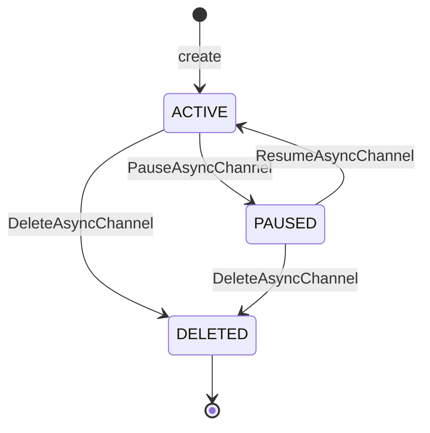

# Async Channel

Status: **draft**

Shapes & RPCs: [`async_channel.proto`](../../franz/api/franz/v1/async_channel.proto) —
`AsyncChannel`, `ChannelType`, `ChannelState`, `AsyncChannelService`.
Access-policy shapes live in the same file but are specified in
`003.5-access-policy.md`.

## Concepts

An **Async Channel** is the resource a service team declares — the customer-facing
boundary of one asynchronous communication path. It is **abstract**: it names the
channel, its fleet context (labels), and who may use it, but carries **no Kafka
configuration** of its own (that is a cluster/topic concern — `003.6`).

Creating a channel makes Franz **shard** it into `channel_partitions` Kafka Topics
(`003.6`) and place each shard on a Kafka Cluster whose labels satisfy the
channel's `franz.affinity/*` labels (`003.7`). The channel is 1:N to Kafka Topic;
each shard maps to one real topic in one cluster. Shards of the same channel may
land on different clusters. Producers/consumers route to a shard by key hash
through the Franz SDK.

### Shard naming

A shard's Kafka topic name is **`<async-channel-name>-<index>`**, `index` running
`0 .. channel_partitions-1`. The cluster name is **not** part of the topic name, so
a shard keeps its name if it is re-placed onto another cluster. Example: channel
`franz.billing-events` with `channel_partitions = 3` → `franz.billing-events-0`,
`franz.billing-events-1`, `franz.billing-events-2`.

Only one `type` exists today: `CHANNEL_TYPE_KAFKA_TOPIC`. The enum exists so other
substrates (queues, streams) can be added without reshaping the entity.

## Key fields

| Field | Notes |
|---|---|
| `name` | Client-provided, immutable, realm-unique. Also the **shard-name prefix** (`<name>-<index>`). |
| `orn` | Server-assigned. |
| `type` | `ChannelType`; immutable; only `KAFKA_TOPIC` today. |
| `channel_partitions` | **Shard count** — how many Kafka Topics the channel is split into. `≥ 1`. Changing it is a staged re-shard operation, not a plain field write (see State transitions + `003.11`). |
| `labels` | Fleet-context metadata **and** the placement inputs: `franz.affinity/*`, `franz.antiaffinity/*`, `franz.taint/toleration` are read here (`003.7`). Non-`franz.*` labels are free-form and drive `List` filtering and owner attribution. |
| `state` | `ChannelState` — `ACTIVE` / `PAUSED` / `DELETED`; see below. |
| `access_policy` | Embedded `AccessPolicy`; **changed only via `SetAccessPolicy`**, never through `UpdateAsyncChannel`. Semantics in `003.5`. |
| `created_at` / `updated_at` | Audit pair. |

## State transitions

`ChannelState` has three values for now — `ACTIVE` / `PAUSED` / `DELETED`. There is
no `PENDING` or `ERROR` channel state; reconciliation progress and failures live on
the individual Kafka Topics (`003.6`), not on the channel.

- `ACTIVE` — Franz reconciles the channel's shards.
- `PAUSED` (`PauseAsyncChannel`) — Franz stops driving reconciliation for the
  channel's shards; the real topics are left in place. `ResumeAsyncChannel` returns
  to `ACTIVE`.
- `DELETED` — soft delete (`003.11`): the record is retained, agents remove the
  real topics, the `name` is not freed. Terminal.

### Re-sharding (`channel_partitions` change)

Changing `channel_partitions` — up or down — moves key ranges between shards and
risks data loss if done as a single write, so it is a **staged operation**, not a
field in an `UpdateAsyncChannel` mask:

1. Franz adds/marks the shards being added or removed.
2. Producers are moved to the new shard map (SDK re-routes by key hash).
3. Removed shards are drained (consumption continues until lag reaches zero /
   retention elapses), then their Kafka Topics are deleted.

The concrete RPC and step sequencing are specced in `003.11-lifecycle-and-operations.md`.

## Invariants

- `name` and `type` are immutable; `name` is unique within `(realm, async-channel)`.
- `channel_partitions ≥ 1`; it is not settable through an `UpdateAsyncChannel` mask
  (re-shard flow only).
- Shard topic names are exactly `<name>-<0..channel_partitions-1>` and never
  include a cluster name.
- `access_policy` mutations go through `SetAccessPolicy` only; it is never in an
  `UpdateAsyncChannel` mask.
- A channel in `DELETED` rejects every further operation with `FAILED_PRECONDITION`.
- The channel's `state` is server-managed; clients move it only via
  `Pause`/`Resume`/`Delete`.

## Cross-entity behavior

- **Shards into Kafka Topics** — `channel_partitions` shards named
  `<name>-<index>`, each placed independently on one cluster (`003.6`, `003.7`).
- **Placement** — driven entirely by the channel's `franz.*` labels against
  cluster labels (`003.7`). Editing those labels can trigger re-placement — the
  policy for that is an open decision (`003.7`).
- **Access policy** — the embedded document decides which Clients may Read/Write
  the channel (`003.5`); `ListChannelClients` returns the resolved per-client view
  (`003.10`).
- **Governance** — Policies may `ADD_LABEL` / `REMOVE_LABEL` / `SET_STATUS` /
  field-mutate a channel when an indicator limit is crossed (`003.8`).
- **Pause** propagates: a paused channel's Kafka Topics stop being reconciled
  until resume.

## Open questions

1. **Re-shard RPC + step sequencing** — the concrete custom method and the
   ordered, interruptible workflow for changing `channel_partitions` without data
   loss (drain semantics, producer cutover, partial-failure recovery). Specced in
   `003.11-lifecycle-and-operations.md`.
2. **Shard routing key** — where the routing key comes from (SDK-supplied message
   key vs. a declared key field) and the hash function, so producers and consumers
   agree on shard assignment.
3. **Re-placement on label change** — editing `franz.*` labels can make shards
   eligible for different clusters; whether/how Franz moves an existing shard is a
   cross-cutting decision (`003.7`).
