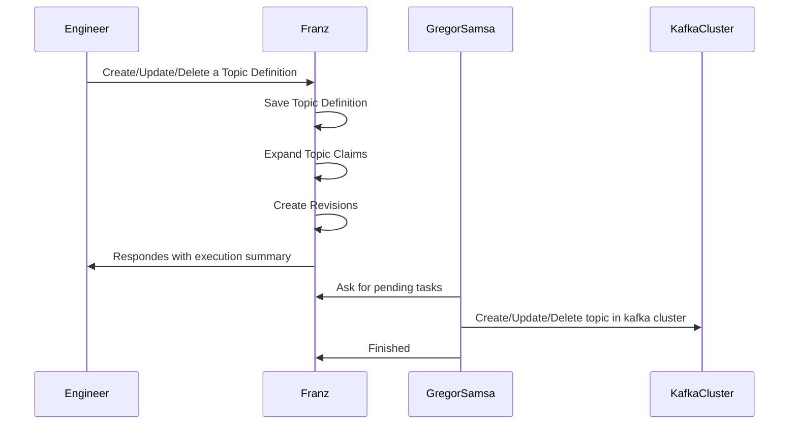

# Topic Cluster Selection

A topic definition says what is the shape of a topic given the name it has and its configuration, but it also needs something to say where it should be in.

When a topic definition is created, it is necessary to find the cluster the actual kafka topics should exist depending. Here is how it works:

> **See also:** [003.6-expansion-engine.md](./003.6-expansion-engine.md) for the full expansion engine specification with implementation details, stale-revision guard, config materialisation, and transaction semantics.

## Topic Definition Expansion

When a topic definition is created, it is necessary to find the cluster the actual kafka topics should exist depending. This action is called Topic Definition Expansion.

It happens on the Creation, Update or Deletion of `Topic Definition`. It is also possible to expecitly call a expansion wheen needed using the endpoint.

`POST` `/api/v0/expand_topics_claims`
```json
// Request Body
{
    "topics": ["topic-list or regex"], // ["*"] for all
    "dry-run": false // execute or just view
}

//--
// Response Body
{
    "topics-definition": [
        {
            "topic-name": "the name",
            "expansion-status": "Expanded" // or PendingEpansion
            "claims": [
                {
                    "labels": {
                        "my-label": "..",
                        //..
                    },
                    "cluster": {
                        "name": "cluster-name",
                        "bootstrap-url": "localhost:9092",
                        //..
                    },
                    "last-revision": {
                        "topic-configuration": { 
                            //.. topic config
                        },
                        // ..
                    }
                },
            ]
        },
        // ..
    ]
}
```

## Taints

Taints are defined in the cluster labels; tolerations are defined in the topic-definition labels. A topic claim is only placed on a cluster when that cluster's taints are either absent or tolerated by the topic definition.

### Effects

| Effect | Description |
|---|---|
| `no-creation` | Blocks new topic claims from being placed on this cluster. Existing claims are unaffected. |
| `drain` | Actively migrates all topic claims off this cluster to other eligible clusters. Overrides tolerations — no topic can remain. |

### Syntax

Taint on a cluster label:
```json
{
    "franz.taint": "<taint-name>:<effect>"
}
```

Toleration on a topic-definition label (to allow placement on a `no-creation` tainted cluster):
```json
{
    "franz.taint/toleration": "<taint-name>:no-creation"
}
```

### Examples

**Block new topics unless explicitly tolerated:**
```json
// cluster labels
{ "franz.taint": "restricted:no-creation" }

// topic-definition labels (opt-in to this cluster)
{ "franz.taint/toleration": "restricted:no-creation" }
```

**Drain all topics from a cluster:**
```json
// cluster labels
{ "franz.taint": "decommission:drain" }
```
Once this label is set, Franz will relocate all claims on this cluster to other eligible clusters.

### When to use taints

| Scenario | Taint to apply | Why |
|---|---|---|
| **Cluster decommissioning / migration** | `decommission:drain` | Progressively move all topic claims to newer clusters without manual intervention. |
| **Incident isolation** | `unstable:no-creation` | Stop new topics landing on a degraded cluster while keeping existing ones running. |
| **Dedicated / reserved clusters** | `dedicated-<team>:no-creation` | Enforce deny-by-default access; only topics with a matching toleration can be placed here. |
| **Proactive capacity management** | `capacity:no-creation` | Pause new placements before hitting governance hard limits (e.g. `avg-replica-per-broker > 3000`). |
| **Maintenance windows** | `maintenance:no-creation` | Prevent new claims from being created during a rolling broker restart. |

## Affinity and Selection Mechanics
When a `Topic Definition` is created it will use the labels `franz.affinity` to find the cluster that has matching labels. 


Given the Kafka Clusters created to deal with a high volume traffic, in BR Prod.
```json
[
    {
        "name": "br_prod_high_volume_0001",
        //...,
        "labels": {
            "my-fleet/tier": "high-volume",
            "my-fleet/env": "prod",
            "my-fleet/geo": "br",
            "my-fleet/my-label": "team-x",
            "franz.taint": "team-x:no-creation",
            "franz.affinity/weight": 1
        }
    },
    {
        "name": "br_prod_high_volume_0002",
        //...,
        "labels": {
            "my-fleet/tier": "high-volume",
            "my-fleet/env": "prod",
            "my-fleet/geo": "br",
            "my-fleet/my-label": "y",
            "franz.taint": "decomission:drain",
            "franz.affinity/weight": 1
        }
    },
    {
        "name": "br_prod_high_volume_0003",
        //...,
        "labels": {
            "my-fleet/tier": "high-volume",
            "my-fleet/env": "prod",
            "my-fleet/geo": "br",
            "my-fleet/my-label": "z",
            "franz.affinity/weight": 2
        }
    },
    {
        "name": "br_prod_high_volume_0004",
        //...,
        "labels": {
            "my-fleet/tier": "high-volume",
            "my-fleet/env": "prod",
            "my-fleet/geo": "br",
            "my-fleet/my-label": "w",
            "franz.affinity/weight": 1
        }
    },
    {
        "name": "br_prod_low_volume_0005",
        //...,
        "labels": {
            "my-fleet/tier": "low-volume",
            "my-fleet/env": "prod",
            "my-fleet/geo": "br",
            "my-fleet/my-label": "a",
            "franz.affinity/weight": 1
        }
    },
    {
        "name": "br_prod_low_volume_0006",
        //...,
        "labels": {
            "my-fleet/tier": "low-volume",
            "my-fleet/env": "prod",
            "my-fleet/geo": "br",
            "my-fleet/my-label": "b",
            "franz.affinity/weight": 2
        }
    },
    {
        "name": "br_prod_low_volume_0007",
        //...,
        "labels": {
            "my-fleet/tier": "low-volume",
            "my-fleet/env": "prod",
            "my-fleet/geo": "br",
            "my-fleet/my-label": "c",
            "franz.affinity/weight": 1
        }
    }

]

```

Once a Topic Definition with the following affinity is added, it will create a `Topic Claim` and `Topic Revision` for this kafka cluster that matches.

| Topic Definition Labels | Kafka Cluster Matchers | Cluster(s) Selected | Logic |
|---|---|---|---|
|my-fleet/tier=high-volume,<br>my-fleet/env=prod,<br>my-fleet/geo=br|br_prod_high_volume_0003,<br>br_prod_high_volume_0004|br_prod_high_volume_0003 | (since it has the biggest weight)|
|my-fleet/tier=high-volume,<br>my-fleet/env=prod,<br>my-fleet/geo=br,<br>franz.taint/toleration=team-x:no-creation|br_prod_high_volume_0001,<br>br_prod_high_volume_0003,<br>br_prod_high_volume_0004|br_prod_high_volume_0003 | (since it has the biggest weight)|
|my-fleet/tier=high-volume,<br>my-fleet/env=prod,<br>my-fleet/geo=br,<br>franz.taint/toleration=team-x:no-creation,<br>my-fleet/my-label=team-x| br_prod_high_volume_0001| br_prod_high_volume_0001 | (unique that matches and it also tolerates)|
|my-fleet/tier=high-volume,<br>my-fleet/env=prod,<br>my-fleet/geo=br<br>my-fleet/my-label=team-x| br_prod_high_volume_0001| `None` |  No cluster matches, in this case the toleration also does not allow one of the selections |

Example of how a topic definition would look like:
```json
{
    "franz.affinity/selector": "my-fleet/tier=high-volume,my-fleet/env=prod,my-fleet/geo=br,my-fleet/my-label=x"
}
```

Now let's say you want that the same topic exists in more then one avaialable cluster, it is possible to use the `franz.expansion/shard` to do that. When it is not provided, the default value is `1` like:

```json
{
    "franz.affinity/selector": "my-fleet/tier=high-volume,my-fleet/env=prod,my-fleet/geo=br",
    "franz.affinity/shard-size": "2"
}
```

In this case the clusters `br_prod_high_volume_0003` and `br_prod_high_volume_0004` will match and will be selected.

When all expansions mechanism happens, the Topic Definition `expansion-status` is `Expanded`. If any expansion is missing, the `expansion-status` is `PendingExpansion`


When a topi is created:


