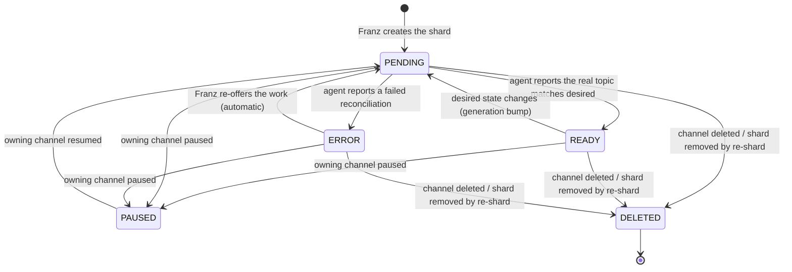

# Kafka Topic

Status: **ready**

Shapes & RPCs: [`kafka.proto`](../../franz/api/franz/v1/kafka.proto) — `KafkaTopic`,
`KafkaTopicState`, `Consumption`, `TrafficShare`, `KafkaTopicService`.

## Concepts

A **Kafka Topic** is one shard of an Async Channel (`003.4`), placed on one Kafka
Cluster, and the record that tracks **reconciliation** between Franz's desired
state and the real topic in that cluster. Formerly "Topic Claim".

Franz **owns the whole entity** — it creates and deletes Kafka Topics as a
consequence of channel create / delete / re-shard / placement, and every field is
Franz-set. The one client-facing operation is `SetConsumption`. There is **no**
`Create` / `Update` / `Delete` RPC and **no** standalone retry RPC.

`TopicRevision` and the `TopicConfiguration` entity are gone (ADR-API-002):
a Kafka Topic carries its desired state directly, a `topic_configuration` map, and
a bare `generation` token.

## Key fields

| Field | Notes |
|---|---|
| `name` | Franz-generated, `<async-channel-name>-<shard-index>`; also the real topic name in the cluster. Immutable. |
| `orn` | Server-assigned. |
| `async_channel` / `kafka_cluster` | The owning channel and the cluster this shard is placed on. Exactly one each. |
| `state` | `KafkaTopicState` — `PENDING` / `READY` / `PAUSED` / `ERROR` / `DELETED`; see below. |
| `consumption` | `Consumption` — `ENABLED` / `DISABLED`. Independent of `state`. `DISABLED` drains the shard (see Cross-entity behavior). Changed only via `SetConsumption`. |
| `topic_configuration` | `map<string,string>` — the per-shard layer of the config merge (retention, cleanup policy, …); wins over `KafkaCluster.cluster_configuration` (`003.3`). Does **not** carry partition count or replication factor. |
| `partitions` | `int32` — desired Kafka partition count for the real topic. Dedicated field, not a config-map key. May only increase. |
| `replication_factor` | `int32` — desired replication factor for the real topic. Dedicated field. |
| `traffic_share` | `TrafficShare` (`value` + `unit`) — the **intended** share of channel traffic routed to this shard (an intention, not a measurement). Franz defaults to an equal split across shards with `consumption = ENABLED`; a drained shard is `0`. Producers weight routing by this value. |
| `generation` | `int64` optimistic-concurrency token, bumped on every desired-state change. Bare token — its use in agent reporting is deferred to the interaction ADR. |
| `created_at` / `updated_at` | Audit pair. |

## State transitions

- `PENDING` — desired state declared, real topic not yet confirmed to match.
- `READY` — the real topic exists and matches the merged desired configuration.
- `ERROR` — the last reconciliation attempt failed. Franz retries automatically;
  there is no manual retry RPC. The failure reason is surfaced via telemetry /
  operational signal (`003.11`), not a persisted `error` field on the topic.
- `PAUSED` — set only by the owning channel's pause; agents stop reconciling.
- `DELETED` — terminal soft delete; an agent removes the real topic.

`consumption` is orthogonal: a `READY` topic may be `ENABLED` or `DISABLED`.

## Invariants

- `name`, `async_channel`, `kafka_cluster` are immutable for the life of the shard.
- Every Kafka Topic belongs to exactly one non-deleted Async Channel (or is itself
  `DELETED`).
- `state` and `traffic_share` are server/agent-managed; clients never write them.
- `SetConsumption` is the only client-initiated mutation.
- `partitions` may only increase — a change that would reduce it is rejected
  (`INVALID_ARGUMENT`).
- `state = DELETED` rejects every further operation with `FAILED_PRECONDITION`.

## Cross-entity behavior

- **Config merge** — the reconciled topic *configuration* is
  `KafkaCluster.cluster_configuration` ← `KafkaTopic.topic_configuration`
  (per-shard keys win). The merge is materialised at create/change time; later
  edits to `cluster_configuration` do not re-reconcile existing shards (`003.3`).
  `partitions` / `replication_factor` are **not** part of this merge — they are
  dedicated fields; Franz seeds them from cluster defaults at shard creation.
- **Channel propagation** — channel `PAUSED` → all its shards `PAUSED`;
  channel `DELETED` → all its shards `DELETED`; channel resume → shards back to
  `PENDING` then `READY`.
- **Consumption / drain** — `SetConsumption(DISABLED)` drains the shard: producers
  stop routing new traffic to it (the channel's remaining shards absorb the key
  range), `traffic_share` falls to zero, and the topic plus its data are retained.
  `ENABLED` restores it to the routing set. This is the mechanism the re-shard flow
  (`003.4`) uses to retire a shard before deleting it.
- **Traffic share** — an **intended** distribution, not an observed one. Franz
  keeps it as an equal split across the shards with `consumption = ENABLED` and
  rebalances it when a shard is drained or restored or when the shard count
  changes. It is an input to producer routing (the SDK weights shard selection by
  it) and is shown in the console load-distribution view. Whether an operator or a
  governance Policy may override the split is an open question.
- **Governance** — per the `003.8` write whitelist, a Policy may change a Kafka
  Topic's `partitions` (increase-only), `replication_factor`,
  `topic_configuration.<key>`, `consumption`, and non-`franz.*` labels when an
  indicator limit is crossed. It **cannot** set `state` (topic state is derived /
  follows the channel).

## Open questions

1. **Seeding `partitions` / `replication_factor`** — which
   `cluster_configuration` keys act as the defaults, and whether a channel-level
   hint may raise them.
2. **Overriding `traffic_share`** — whether an operator (and/or a governance
   Policy) may set a non-equal split, through what RPC, and how the remaining
   shards are re-normalised.
3. **Automatic retry cadence** — backoff, cap, and whether a stuck `ERROR` shard
   ever needs operator input. Belongs to the agent interaction ADR.
4. **`generation` semantics** — exact rules for how agents echo it and how Franz
   rejects stale reports. Agent interaction ADR.
5. **Reconciliation failure visibility** — where an operator reads *why* a shard
   is in `ERROR` (signal history in `003.11` vs. a field here).
