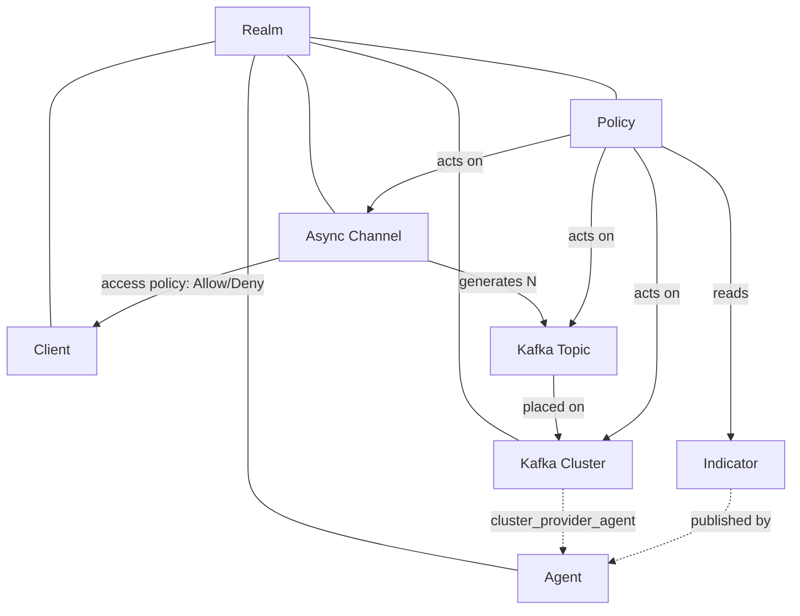

# Franz

Status: **ready**

Franz is the **control plane** for an async fleet. It stores the declared state of
async resources, applies fleet-wide governance, and receives signals about their
realization. Franz **never connects to Kafka** — registered agents do the
real-world work (`../001-architecture-overview.md`,
`../004-kafka-topic-reconciliation/`, `../005-odradek/`).

## The model

- An **Async Channel** is the primary resource a service team declares. Creating a
  `kafka-topic` channel makes Franz generate one or more **Kafka Topics** and
  place each on a **Kafka Cluster** whose labels satisfy the channel's
  `franz.affinity/*` labels.
- A **Client** reads from or writes to a channel through the Franz SDK; the
  channel's **access policy** decides what it may do.
- **Agents** act on the fleet. A **Governance Policy** watches an **Indicator**
  (published by Telemetry Agents) and, when a limit is crossed, mutates the
  resources a matcher selects — Franz's declared state, which then reconciles.

## Authoritative contract

Wire shapes and RPCs live in **`../../franz/api/franz/v1/`** (`.proto`, edition 2024,
buf). These `003.x` documents own **semantics, invariants, state transitions, and
cross-entity behaviour** — they give a short "key fields" summary and link to the
proto, not full field tables. Where the two disagree, the proto wins for shapes,
the doc wins for meaning. See `003.1-conventions.md` for the rules common to all.

## Entities

| Entity | Proto | Previously |
|---|---|---|
| **Async Channel** | `async_channel.proto` | Topic Definition |
| **Kafka Topic** | `kafka.proto` | Topic Claim |
| Kafka Cluster | `kafka.proto` | Kafka Cluster |
| **Access Policy** | `async_channel.proto` | — |
| **Agent** | `agent.proto` | — (Gregor Samsa / Odradek were implicit) |
| **Client** | `client.proto` | — |
| Policy / Indicator | `governance.proto` | Governance (EDN draft) |

## Glossary

| Term | Meaning |
|---|---|
| **Realm** | Tenant and authorization boundary. Every resource belongs to exactly one. |
| **ORN** | `orn:<realm>:<type>:<name>` — opaque, server-assigned identifier. |
| **Async Channel** | The customer-facing async communication boundary. Only type: `kafka-topic`. |
| **Kafka Topic** | One generated topic of a channel, placed on one cluster; tracks reconciliation and consumption. |
| **Kafka Cluster** | A registered Kafka cluster: connection strings, fleet-context labels, default config, optional provider agent. |
| **Topic configuration** | Plain `map<string,string>`, merged `cluster default → per-topic`. Not a standalone entity. |
| **Placement / selection** | Choosing which clusters a channel's topics live on, from the channel's `franz.affinity/*` labels (`003.7`). |
| **Access Policy** | One document per channel; Allow/Deny statements (explicit Deny wins, zero trust) deciding which clients may Read / Write. |
| **Agent** | A registered program acting on the fleet: Cluster Provider, Resource Provider, Telemetry Agent, or Custom. |
| **Client** | A fleet-wide identity using channels through the SDK; carries no permission of its own. |
| **Policy** | Governance rule — watch an Indicator, and when a Limit is crossed run Actions on matched resources. Reactive only. |
| **Indicator** | A named value published by Telemetry Agents that Policies read. |
| **Reconciliation** | An agent bringing a real Kafka topic to match its Kafka Topic's desired state. |
| **`generation`** | A counter on a Kafka Topic bumped on every desired-state change — a bare optimistic-concurrency token. |

## Sub-documents

| # | Document | Covers |
|---|---|---|
| `003.1` | Conventions | ORN, realm, pagination, the one selector grammar, reserved labels, errors |
| `003.2` | API Authorization | Placeholder — console/API authz model not yet decided |
| `003.3` | Kafka Cluster | Registration, `state` (active/paused/deleted), config-merge base layer |
| `003.4` | Async Channel | The declared resource; `state` (active/paused/deleted), sharding into N Kafka Topics, re-shard flow |
| `003.5` | Access Policy | Allow/Deny evaluation for clients on a channel |
| `003.6` | Kafka Topic | State machine, `generation`, consumption, config merge |
| `003.7` | Placement & Selection | Affinity, anti-affinity, taints/tolerations, shard-size |
| `003.8` | Governance | Policies, indicators, actions, evaluation |
| `003.9` | Agents | Agent registry (interaction model is a separate ADR) |
| `003.10` | Clients | Fleet-wide SDK identity; no permission of its own; consumer-group observation; derived access views |
| `003.11` | Lifecycle & Operations | Pause/resume, soft delete, migration, signal history |
| `003.12` | Persistence & Data Model | PostgreSQL schema — table per entity, `jsonb` maps/documents, materialized topic config, migrations |

## Dependencies

Go, PostgreSQL, protobuf / gRPC (see `../002-monorepo-structure/`).
