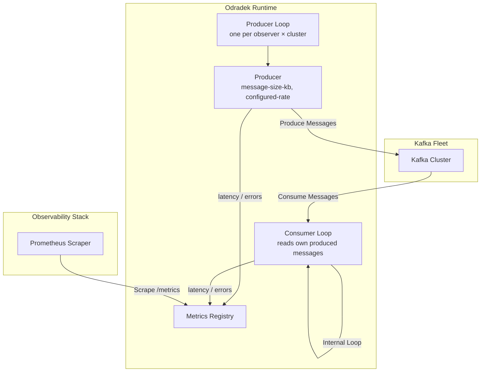

# Odradek

The silent observer that never leaves.

## How it works

Odradek works by creating telemetry mimicking the clients, producing and consuming messages from the kafka clusters.

Given the configuration, odradek will produce/consume messages with a given volume, size for topics with a specific configuration. 

```json
{
    "observers": [
        {
            "name": "small-messages-small-topic",
            "clusters": ["local-1"],
            "topic": "SMALL-TOPIC",
            "parallelism": 1,
            "messages-per-bucket": 10,
            "message-size-kb": 100,
            "producer-config": {
                "acks": "all",
                "linger.ms": 0,
                "retries": 3,
                "max.block.ms": 5000,
                "delivery.timeout.ms": 5000,
                "request.timeout.ms": 1500
            },
            "consumer-config": {
                "max.poll.interval.ms": 30000,
                "max.poll.records" : 1,
                "heartbeat.interval.ms": 3000,
                "session.timeout.ms": 30000,
                "group.id": "SMALL_MESSAGES_SMALL_TOPIC",
                "group.min.session.timeout.ms": 6000,
                "group.max.session.timeout.ms": 30000
            }
        },
        {
            "name": "small-messages-big-topic",
            "clusters": ["local-1"],
            "topic": "BIG-TOPIC",
            "message-size-kb": 100,
            "parallelism": 5,
            "messages-per-bucket": 100,
            "producer-config": {
                "acks": "all",
                "linger.ms": 0,
                "retries": 3,
                "delivery.timeout.ms": 5000,
                "request.timeout.ms": 1500
            },
            "consumer-config": {
                "max.poll.interval.ms": 30000,
                "max.poll.records" : 1,
                "heartbeat.interval.ms": 3000,
                "session.timeout.ms": 30000,
                "group.min.session.timeout.ms": 6000,
                "group.max.session.timeout.ms": 30000
            }
        },
        {
            "name": "big-messages-big-topic",
            "clusters": ["local-1"],
            "topic": "BIG-TOPIC-LARGE-MESSAGES",
            "message-size-kb": 9216,
            "parallelism": 1,
            "messages-per-bucket": 50,
            "producer-config": {
                "acks": "all",
                "linger.ms": 0,
                "retries": 3,
                "delivery.timeout.ms": 5000,
                "request.timeout.ms": 1500
            },
            "consumer-config": {
                "max.poll.interval.ms": 30000,
                "max.poll.records" : 1,
                "heartbeat.interval.ms": 3000,
                "session.timeout.ms": 30000,
                "group.min.session.timeout.ms": 6000,
                "group.max.session.timeout.ms": 30000
            }
        }
    ],
    "producer-engine": {
        "rate-interval-ms": 100
    },
    "kafka_clusters": {
        "local-1": {
            "bootstrap-url": "localhost:9092"
        }
    }
}
```

### Consumer Behavior

- The consumer runs its own independent loop — it is not triggered by the producer.
- It reads messages from the same topic the producer writes to.
- The consumer group ID is derived from the observer name uppercased (e.g. observer `small-messages-small-topic` → group `SMALL-MESSAGES-SMALL-TOPIC`), but can be overriden by the consumer config.
- The consumer always starts from the **latest offset** — it never replays existing messages.

### Topic Lifecycle

Odradek does **not** create topics. If the topic configured in an observer does not exist on the cluster, the producer will report an error via `kafka_odradek_messages_production_error_total`. The topic must be created beforehand — either manually or through Franz.

It is recomended the topic have the configuration in terms of partition similar to what you want to check the performance. The retention could be small, as historical messages are not used. So 10 minutes of retention is more then enough.

## High level architecture


## Metrics Generated

|Metric|Labels|Description
|---|---|---|
|`kafka_odradek_messages_produced_total`|`cluster_name`,`observer`, `topic`, `message_size_kb`, `configured_rate_interval`|Total of messages produced by configured observer and clusters|
|`kafka_odradek_messages_production_latency_ms_histogram_bucket`|`cluster_name`,`observer`, `topic`, `message_size_kb`, `configured_rate_interval`|Production latency ms in histogram bucket|
|`kafka_odradek_messages_production_error_total`|`cluster_name`,`observer`, `topic`, `message_size_kb`, `configured_rate_interval`|Total of errors when producing messages. Incremented when the topic does not exist or the broker is unreachable.|
|`kafka_odradek_messages_fetched_total`|`cluster_name`,`observer`, `topic`, `message_size_kb`, `configured_rate_interval`|Total of messages fetched by configured observer and clusters|
|`kafka_odradek_messages_fetch_error_total`|`cluster_name`,`observer`, `topic`, `message_size_kb`, `configured_rate_interval`|Total of errors when consuming messages|
|`kafka_odradek_messages_fetch_latency_ms_histogram_bucket`|`cluster_name`,`observer`, `topic`, `message_size_kb`, `configured_rate_interval`|Consumption fetch latency ms in histogram bucket, once message reach consumer|
|`kafka_odradek_e2e_message_age_ms_histogram_bucket`|`cluster_name`,`observer`, `topic`, `message_size_kb`, `configured_rate_interval`|Messages age once it reaches the consumer|
|`kafka_odradek_full_e2e_ms_histogram_bucket`|`cluster_name`,`observer`, `topic`, `message_size_kb`, `configured_rate_interval`|Time from the production until the message is commited by the consumer|

### Histogram Bucket Boundaries

All histograms (`production_latency_ms`, `fetch_latency_ms`, `e2e_message_age_ms`, `full_e2e_ms`) use the following bucket boundaries (in milliseconds):

```
[5, 10, 15, 25, 30, 40, 50, 80, 100, 250, 300, 500, 800, 1000, 1500, 2000, 3000, 4000, 5000, 10000, 15000, 20000, 25000, 30000]
```

### Producer Configuration

Producer configuration is intentionally exposed in the config and must be provided explicitly. There are no defaults assumed — the operator owns these values.

## Endpoints

| Method | Endpoint | Description |
|---|---|---|
| `GET` | `/ops/config/dump` | Dump active configuration (sensitive values redacted) |
| `GET` | `/ops/health` | Health check — reports overall service health |
| `GET` | `/ops/readiness` | Readiness probe — signals when the service is ready to receive traffic |
| `GET` | `/ops/liveness` | Liveness probe — signals the process is alive |
| `GET` | `/metrics` | Prometheus metrics scrape endpoint |


