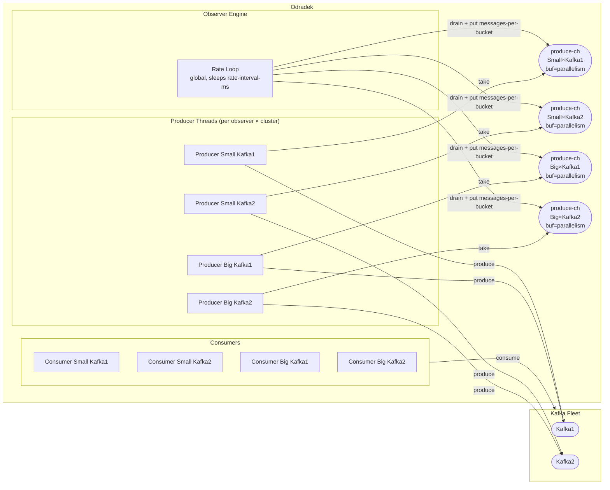

# Odradek — Implementation Design

Implementation design for the Odradek SLO metrics exporter. Covers technology choices, component architecture, concurrency model, and all behavioral rules derived from the spec.

See [005-odradek.md](./005-odradek.md) for the feature spec.

---

## Technology Stack

| Concern | Library | Rationale |
|---|---|---|
| Kafka producer/consumer | `org.apache.kafka/kafka-clients` (direct Java interop) | Maximum control, zero wrapper surprises. A thin `clients/kafka.clj` wraps construction only. Gregor Samsa will reuse the same pattern. |
| Prometheus metrics | `io.prometheus/prometheus-metrics-core` 1.x + `prometheus-metrics-exposition-formats` | New client API, maintained path forward. `/metrics` endpoint is a Ring handler that calls `PrometheusRegistry.scrape()`. |
| HTTP server | Ring + Compojure + Jetty (same as Franz) | Skeleton already in place. 5 static GET endpoints need no interceptor sophistication. Consistent with the monorepo. |
| Config | Aero | Already in place. |
| Lifecycle | Stuart Sierra Component | Already in place. |
| Core.async | Clojure core async | For thread control. |


---

## Component System Map

```
:config           — loads config.edn (observers, kafka_clusters, producer config)
:metrics-registry — owns the PrometheusRegistry instance
:observer-engine  — depends on :config and :metrics-registry
                    starts and stops all producer and consumer loops
:api              — depends on :metrics-registry and :config
                    assembles Ring handler (ops routes + /metrics route)
:http-server      — depends on :config and :api
```

The `:observer-engine` component owns all threads. The `:metrics-registry` component is shared between the engine (writes) and the API (reads for scrape).

---
## Concurrency Model

One `produce-ch` is created per observer × cluster pair. Each channel has a buffer of size `parallelism`. The rate control loop puts `messages-per-bucket` messages onto each observer's channel every `rate-interval-ms`. Producer threads take from their assigned channel and call `.send()` concurrently up to the `parallelism` limit.

If a channel is still full when a new loop iteration starts (producers fell behind), `drain-chan` is called first to discard stale buffered messages before the new batch is enqueued. In-flight sends already taken by a producer thread are unaffected.


---

## Observer Engine

The `ObserverEngine` Stuart Sierra Component:

```clojure
;; On start:
;; - Start the global rate loop thread
;; - For each [observer × cluster] pair:
;;   1. Create produce-ch with buffer size = observer.parallelism
;;   2. Start observer.parallelism producer threads, each taking from produce-ch
;;      and calling KafkaProducer.send() with the message payload
;;   3. Build a KafkaConsumer and start its consumer thread
;;   4. Store channel, thread refs, and running? atom in a registry atom

;; On stop:
;; - Set all running? atoms to false
;; - Close all produce-ch channels (unblocks pending takes)
;; - Call .wakeup() on each KafkaConsumer (interrupts blocking .poll via WakeupException)
;; - Join all threads with 10s timeout
;; - Interrupt threads that did not terminate within the grace period
;; - Close all KafkaProducer and KafkaConsumer instances
```

Observer-level isolation: each loop has its own `try/catch`. A crash in one loop must never propagate to other loops. See [Error Isolation](#error-isolation).

---

### Rate Control

The ObserverEngine runs a single global rate loop that ticks every `rate-interval-ms`. On each tick, for every (observer × cluster) pair it drains any stale messages from the pair's channel, then enqueues `messages-per-bucket` fresh messages. Each message is the binary payload described in [Message Payload Format](#message-payload-format).

```
loop:
  for [observer cluster] in observer-cluster-pairs
    drain-chan(produce-ch[observer][cluster])
    for _ in range(0..observer.messages-per-bucket)
      payload !> produce-ch[observer][cluster]
    done
  done
  sleep(rate-interval-ms)
```

`parallelism` controls the channel buffer size and the number of producer threads taking from it — up to `parallelism` `.send()` calls can be in-flight concurrently per (observer × cluster) pair.

### Message Keys

`null` keys. Triggers round-robin partition assignment — exercises the entire cluster, not just one partition.

### Missing Topic

If the topic does not exist, `.send()` blocks until `max.block.ms` then throws. The loop catches the exception, increments `kafka_odradek_messages_production_error_total`, backs off, and retries. The loop never exits — it keeps retrying until the topic is created or the component is stopped.

### Metrics cross process

For metrics that will calculate cross process (for instance the E2E latency), some metadata will be sent through the kafka messages headers. 

|Header|Description|
|---|---|
|`com.franz.odradek/produced-at`| The exactly moment the message was produced |
|`com.franz.odradek/message-id`| A random uuid just to help in loging and any debug |

The consumer will get the metadata like:
- the `produced-at` once the messages is fetched and before commit to know how much it takes to reach consumer (message age)
- the `produced-at` after commiting the message to include the commit time in the E2E calculation.

---

## Consumer Loop

One thread per observer × cluster pair, running independently from the producer loop.

### Startup

On start, the consumer seeks to the **latest offset** on all partitions of the topic before entering the poll loop. It never replays existing messages.

### Poll Loop

```
loop:
  try:
    records = consumer.poll(Duration/ofMillis 500)
    calculate_message_fetch_metric
    for each record:
      latency = now() - embedded-timestamp(record)
      calculate_message_age_metric
      increment consumed_total counter
      consumer.commitSync()        ;; manual commit after each message
      calculate_full_e2e_metric
  catch WakeupException:
    exit loop                     ;; triggered by .wakeup() on stop
  catch Exception:
    increment fetch_error_total
    backoff-and-retry
  recur
```

### Offset Commits

Manual commit via `commitSync()` after processing each individual message (`max.poll.records=1`). Auto-commit is disabled (`enable.auto.commit=false`). This gives precise control over what has been acknowledged and avoids marking messages as consumed before latency has been recorded.

### Consumer Configuration

Fixed properties:
- `key.deserializer` = `ByteArrayDeserializer`
- `value.deserializer` = `ByteArrayDeserializer`
- `group.id` = `UPPERCASE(observer-name)` (e.g. `SMALL-MESSAGES-SMALL-TOPIC`)
- `auto.offset.reset` = `latest`
- `enable.auto.commit` = `false`
- `max.poll.records` = `1`
- `bootstrap.servers` = from `kafka_clusters[cluster-name].bootstrap-url`

---

## Message Payload Format

All messages produced by Odradek use a fixed binary format:

```
[0..7]   — 8 bytes — production timestamp (epoch milliseconds, big-endian long)
[8..N]   — padding bytes (random) to reach message-size-kb
```

The consumer reads the first 8 bytes as a `long`, computes:

```
end-to-end-latency-ms = consumption-time-ms - embedded-timestamp-ms
```

This is what `kafka_odradek_messages_fetch_latency_ms_histogram_bucket` measures — the time from production until the message is fetched by the consumer, not just the Kafka client poll RTT.

---

## Error Isolation

Each loop wraps its entire body in a `try/catch Throwable`. On any uncaught exception:

1. Log the error with observer name and cluster name.
2. Increment the relevant error counter (`production_error_total` or `fetch_error_total`).
3. Update the loop's status in the shared observer status atom to `:error`.
4. Sleep with exponential backoff: 1s, 2s, 4s, 8s, ... capped at 10s.
5. Retry — the loop never exits unless `running?` is false.

A crash or persistent error in one loop has **zero effect** on other loops.

---

## Health Checks

Each observer loop publishes its status to a shared `observer-statuses` atom:

```clojure
{[:observer-name :cluster-name :producer] :running | :backoff | :stopped
 [:observer-name :cluster-name :consumer] :running | :backoff | :stopped}
```

| Endpoint | Logic | Failure |
|---|---|---|
| `/ops/liveness` | Always `200` | Process hung — needs restart |
| `/ops/readiness` | At least one loop is `:running` | No meaningful metrics yet — gates Prometheus scraping |
| `/ops/health` | All loops are `:running` or `:backoff` (not `:stopped`); no loop has been `:backoff` continuously for > 5 minutes | Degraded — needs investigation |

**Why readiness matters:** if no loops are running, `/metrics` returns zero counters, which would trigger false SLO alerts downstream.

---

## Metrics Registry Component

The `MetricsRegistry` Stuart Sierra Component:

- On `start`: creates a `PrometheusRegistry` and registers all 8 metrics (3 counters, 5 histograms) with their label names and histogram bucket boundaries.
- On `stop`: no-op (registry is stateless beyond in-memory counters).

All metrics are pre-registered at startup with fixed label names. The observer engine receives the registry and calls `.labelValues(...)` to get the labelled metric instance per loop.

The `/metrics` Ring handler calls `registry.scrape()` and returns the result as `text/plain; version=0.0.4; charset=utf-8`.

---

## Namespace Layout

Following the project conventions:

```
src/odradek/
  clients/
    kafka.clj              ;; KafkaProducer + KafkaConsumer construction helpers
  components/
    config.clj             ;; (already exists)
    api.clj                ;; (already exists — add /metrics route)
    http_server.clj        ;; (already exists)
    metrics_registry.clj   ;; PrometheusRegistry component
    observer_engine.clj    ;; owns all producer/consumer threads
  controllers/
    router.clj             ;; (already exists — add /metrics route)
    middleware.clj         ;; (already exists)
  logic/
    observer.clj           ;; pure functions: payload encoding, rate window calc, latency extraction
  ops/
    health.clj             ;; reads observer-statuses atom
    handlers.clj           ;; (already exists)
  wire/
    in.clj                 ;; config parsing and validation
  system.clj               ;; (update: add :metrics-registry and :observer-engine)
  core.clj                 ;; (already exists)
```
