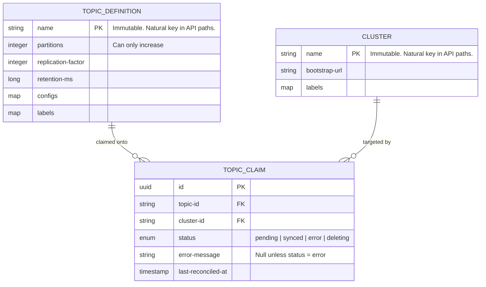
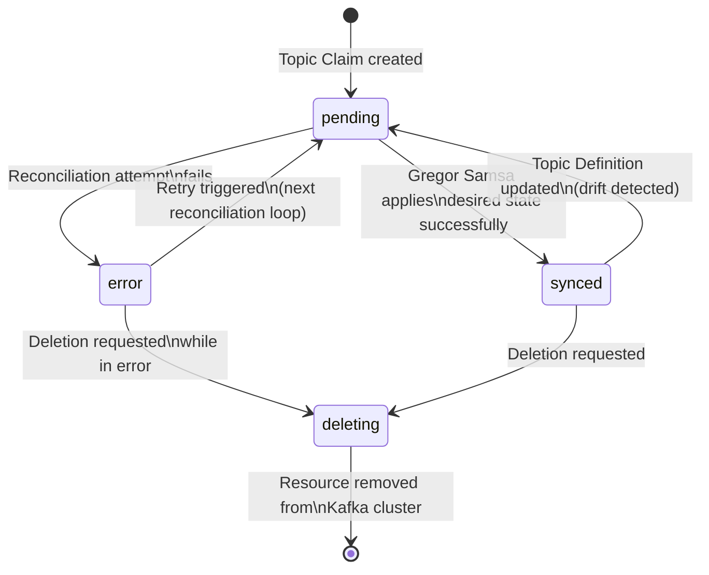
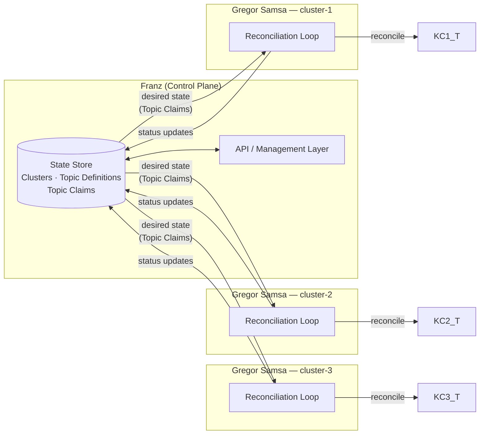

# Architecture Overview

Describe how the management of a big kafka fleet with resource across many clusters and locations.

## Franz

Is aware of the Kafka cluster and its resources (topic, acl, etc) across the fleet. It will contain the state of cluster registered and the topics that are inside them. It has the tools to manage the resources configuration, cascade them to the actual resource and keep them inside a certain governance.

**Cluster**
| Field | Type | Required | Description |
|---|---|---|---|
| `name` | `string` | Yes | Unique identifier for the cluster. Immutable after creation. Used as the natural key in API paths. |
| `bootstrap-url` | `string` | Yes | Kafka bootstrap server URL (e.g. `broker-1:9092,broker-2:9092`). |
| `labels` | `map<string, string>` | No | Arbitrary key-value metadata for categorization and filtering. Defaults to an empty map. |

**Topic Definition**

| Field | Type | Required | Description |
|---|---|---|---|
| `name` | `string` | Yes | Unique topic name. Immutable after creation. Used as the natural key in API paths. |
| `partitions` | `integer` | Yes | Number of partitions. Can only increase, never decrease. |
| `replication-factor` | `integer` | Yes | Number of replicas per partition. |
| `retention-ms` | `long` | No | Message retention time in milliseconds. When omitted, the broker default applies. |
| `configs` | `map<string, string>` | No | Additional Kafka topic configuration entries (e.g. `cleanup.policy`, `compression.type`). Defaults to an empty map. |
| `labels` | `map<string, string>` | No | Arbitrary key-value metadata for categorization and filtering. Defaults to an empty map. |

**Topic Claim**

| Field | Type | Required | Description |
|---|---|---|---|
| `id` | `uuid` | Yes | System-generated unique identifier. |
| `topic-id` | `FK` | Yes | Foreign key referencing the topic definition. |
| `cluster-id` | `FK` | Yes | Foreign key referencing the target cluster. |
| `status` | `enum` | Yes | One of: `pending`, `synced`, `error`, `deleting`. |
| `error-message` | `string` | No | Details of the last reconciliation error. Null when status is not `error`. |
| `last-reconciled-at` | `timestamp` | No | Timestamp of the last successful or attempted reconciliation. Null if never reconciled. |

### Franz Domain Model

### Topic Claim Reconciliation Flow

## Gregor Samsa

Is aware of a single cluster and deals with its resource, like topic, acls and make sure governance is applied. It receive the expected state defined in Franz and make sure it is applied to the actual kafka cluster, reconciling as it as needed.

## Overview

